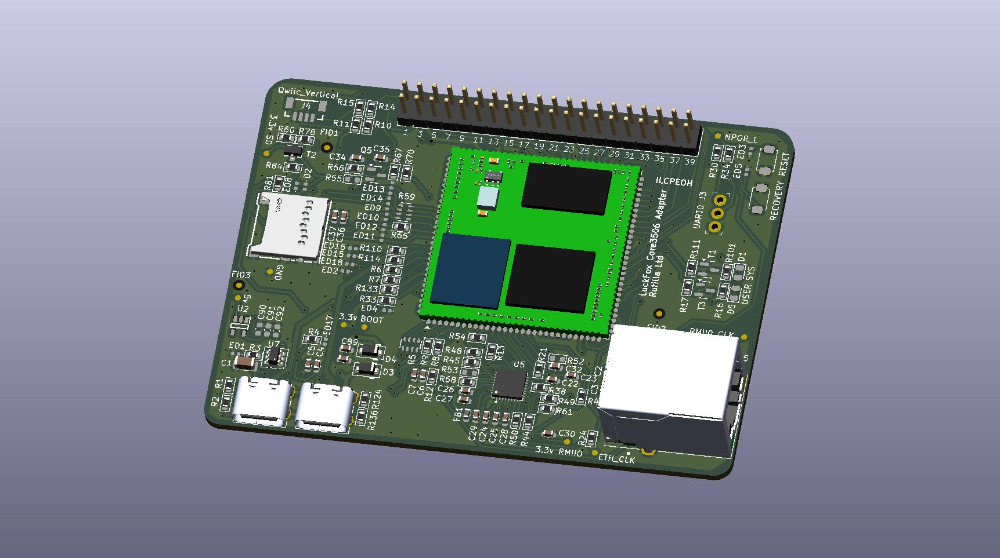

<!-- {{LOGO — add the Rufilla logo here once an asset lives in this repo, e.g. }} -->

# Foxbridge — Luckfox Core3506 carrier board

[](LICENSE)
<!-- Add build and release badges when CI is set up. -->

A carrier board for the [Luckfox Core3506](https://wiki.luckfox.com/Core3506/Introduction/)
system-on-module (SoM), for anyone who wants the RK3506 on a Raspberry Pi Model B-sized board
(85 × 56 mm) with Ethernet, USB-C, a DSI display & a 40-pin header. Designed in KiCad 10 by
Rufilla Ltd., from the [Luckfox Lyra Pi](https://www.luckfox.com/Luckfox-Lyra-Pi) reference
design. Revision A is a prototype: it has been built & brought up, with three hardware faults.

| | |
|---|---|
| **Client** | Internal |
| **Project code** | Foxbridge |
| **Status** | Prototype — Revision A built & reworked; Revision B in design |



> **Revision A has been built & brought up with three hardware faults.** USB host (OTG1) does
> not work without two reworks. Read the [errata](docs/errata.md) before ordering boards.

## Overview

The board breaks the Core3506 SoM out to a Raspberry Pi Model B footprint. Each subsystem has
its own schematic sheet; [docs/design-notes.md](docs/design-notes.md) explains how each one
works & why.

- **USB-C ×2** — OTG0 (device, flashing & 5 V power input) & OTG1 (host, 500 mA current limit)
- **10/100 Ethernet** — CH182H2 PHY on RMII0, HR911105A RJ45 with integrated magnetics
- **MIPI DSI** — 2-lane, 22-pin 0.5 mm FPC for the Luckfox 7" DSI touchscreen (SKU 25265)
- **40-pin header** — Raspberry Pi-compatible pinout
- **microSD** — TF-110 socket with power switching; see errata E4 for the eMMC SoM
- **RESET & RECOVERY buttons**; UART0 header & Qwiic connector (both not fitted)
- **4-layer, 1.6 mm, impedance-controlled** — built for JLCPCB Economic PCBA

Out of scope for this design:

- No on-board 3.3 V regulator is fitted; the SoM supplies `VCC_3V3`. U2 is reserved for a
  future Wi-Fi/Bluetooth module.
- No Wi-Fi or Bluetooth.
- Power comes only from 5 V on the OTG0 USB-C port — no barrel jack & no PoE.
- The microSD slot does not work with the Core3506 variant that has on-module eMMC.
- No MASKROM button & no mounting holes in Revision A.

## Requirements

**Hardware**

- Luckfox Core3506 SoM (RK3506), fitted to a Foxbridge carrier board, revision A
- USB-C cable on OTG0 for power & flashing; 3.3 V USB-UART on the UART0 header for a console
- Optional: Luckfox 7" DSI touchscreen (SKU 25265), microSD card, Ethernet cable

**Software**

- KiCad 10.0 or later. Checked with 10.0.6.
- [Fabrication Toolkit](https://github.com/bennymeg/JLC-Plugin-for-KiCad) plugin, to regenerate
  the JLCPCB production files
- Third-party symbol & footprint libraries, needed only to update a part from its library:

| Nickname in the design | Library | Install from |
|---|---|---|
| `PCM_SparkFun-*` | SparkFun KiCad Libraries | Plugin & Content Manager (PCM) |
| `PCM_*_AKL` | [Alternate KiCad Library](https://github.com/DawidCislo/Alternate-KiCad-Library) | PCM |
| `PCM_JLCPCB*` | [JLCPCB KiCad Library](https://github.com/CDFER/JLCPCB-Kicad-Library) | PCM, after adding CD_FER's repository |
| `digikey-footprints`, `dk_*` | [Digi-Key KiCad Library](https://github.com/Digi-Key/digikey-kicad-library) | Clone & register by hand (J3 only) |

PCM libraries resolve only with the default nickname prefix `PCM_` (**Preferences → Packages
& Updates**).

## Getting the source

```bash
git clone https://github.com/Rufilla/LuckFox-Core3506-Carrier.git
cd LuckFox-Core3506-Carrier
```

## Building

Open `luckfox_core3506_adapter.kicad_pro` in KiCad. The schematic & board carry a copy of every
symbol & footprint, so the design opens, plots & runs ERC/DRC without the third-party libraries
above. Parts specific to this board are in the project library `lib/` (nickname `Foxbridge`),
with their 3D models embedded.

Regenerate the fabrication outputs from the PCB editor with **Tools → External Plugins →
Fabrication Toolkit**. It reads `fabrication-toolkit-options.json`, excludes do-not-populate
parts & writes the Gerbers, drill, BOM & placement files that are committed in `production/`.

## Flashing / deployment

Ordering Revision A from JLCPCB, in full, is in
[docs/manufacturing.md](docs/manufacturing.md#order-from-jlcpcb). In short:

| File | Upload as |
|---|---|
| `production/luckfox_core3506_adapter.zip` | Gerbers & drill |
| `production/bom.csv` | Bill of materials |
| `production/positions.csv` | Component placement (CPL) |

Order Economic PCBA. Three parts are soldered by hand — J1 (RJ45), H1 (2 × 20 pin header) &
U1 (Core3506) — and the placement preview needs the rotation & offset corrections listed in the
manufacturing notes.

> **NOTE:** the files in `production/` reproduce Revision A exactly, including the faults in
> [docs/errata.md](docs/errata.md). Boards built from them need the E1 & E2 reworks before USB
> host works.

## Usage

Power the board from 5 V over the OTG0 USB-C port; the same port flashes the SoM. The console
is on the UART0 header. Ethernet, DSI & the 40-pin header need no board-level configuration.

Before trusting a freshly built board, check it against the reworks in
[docs/errata.md](docs/errata.md): R3 moved (E1) & R6/R7 bridged (E2). Photographs of both are
in `images/`.

## Testing

Run electrical rules & design rules from the project directory:

```bash
kicad-cli sch erc luckfox_core3506_adapter.kicad_sch
kicad-cli pcb drc --schematic-parity luckfox_core3506_adapter.kicad_pcb
```

Every outstanding ERC & DRC report is listed, with its cause & whether it is a real fault, in
[docs/manufacturing.md](docs/manufacturing.md#erc--drc-status). Schematic parity & unconnected
items are both zero.

## Project structure

```
luckfox_core3506_adapter.kicad_pro   KiCad project; the root schematic, 10 sheets & board sit beside it
lib/                                 Project symbol library & footprint library
production/                          Revision A files as ordered from JLCPCB: Gerbers & drill (.zip), BOM, placement, IPC netlist
docs/                                Design notes, errata, manufacturing notes & the Revision B checklist
images/                              Board render & rework photographs
```

Documentation:

- [Design notes](docs/design-notes.md) — how each subsystem works & why
- [Errata](docs/errata.md) — Revision A faults, reworks & limitations
- [Manufacturing](docs/manufacturing.md) — stack-up, ordering from JLCPCB, ERC/DRC status
- [Revision B checklist](docs/rev-b-checklist.md) — changes planned for the respin

## Security

Report a security problem to [hello@rufilla.com](mailto:hello@rufilla.com) rather than through
a public issue. This repository holds hardware design files only, so no software bill of
materials (SBOM) is produced; the bill of materials for the board is `production/bom.csv`.

## Contributing

Report problems & suggestions through GitHub issues, & send changes as pull requests.

## Licence

Copyright 2026 Rufilla Ltd. Licensed under the [Apache License 2.0](LICENSE).

Symbols, footprints & 3D models copied from third-party libraries remain under their own
licences.

## Support

Rufilla Ltd · Building D5, Culham Campus, Abingdon, Oxfordshire, UK, OX14 3DB
[hello@rufilla.com](mailto:hello@rufilla.com) · +44 (0)1865 601201 · [www.rufilla.com](https://www.rufilla.com)

© 2026 Rufilla Ltd
