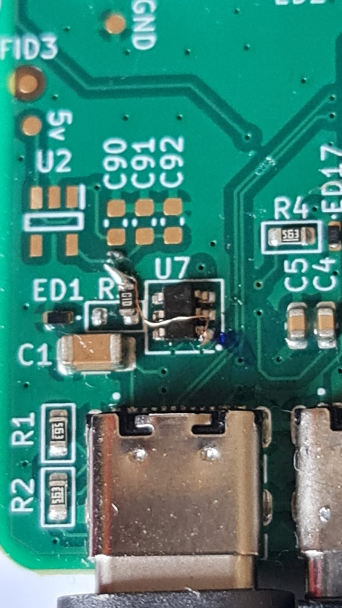
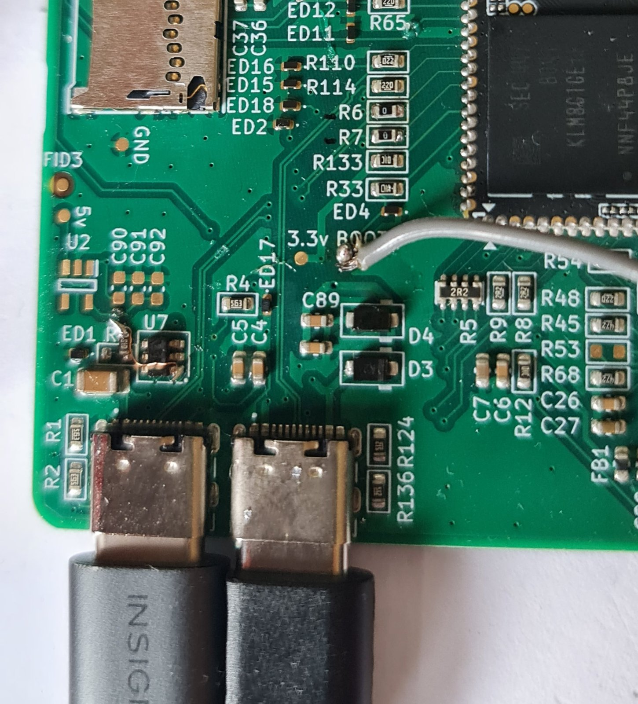

# Revision A errata

Faults & limitations found while bringing up Revision A, with the rework applied to the
built boards. The Revision B changes are tracked in [rev-b-checklist.md](rev-b-checklist.md).

| ID | Problem | Severity | Rework on Revision A |
|---|---|---|---|
| [E1](#e1-otg1-vbus-switch-never-turns-on) | OTG1 VBUS switch never turns on | Critical | Yes — R3 moved |
| [E2](#e2-series-resistors-break-usb-high-speed) | 22 Ω series resistors break USB high speed | Critical | Yes — R6 & R7 bridged |
| [E3](#e3-usb-c-connectors-too-close) | USB-C connectors too close for two cables | Minor | None possible |
| [E4](#e4-microsd-slot-dead-with-the-emmc-som) | microSD slot dead with the eMMC SoM | Limitation | None possible |
| [E5](#e5-recovery-button-does-not-enter-maskrom) | RECOVERY button does not enter maskrom | Minor | Use TP6 |

---

## E1: OTG1 VBUS switch never turns on

**Symptom:** no VBUS on the OTG1 USB-C port (H6); USB devices are not powered.

**Cause:** U7 (TPS2553, active-high EN) has no pull-up to its input. As built:

```
U7 OUT (pin 6) ── R3 100 kΩ ──┬── EN (pin 3)
                              ├── FAULT# (pin 4)
                              └── C4 100 nF ── GND
```

R3 pulls EN up to OUT, which stays at 0 V until the switch is on, so EN never rises. FAULT#
is also tied directly to EN.

**Rework (applied 2026-04-12):** lift R3 pin 1 off OUT & wire it to U7 pin 1 (IN), making R3
an EN pull-up to `VCC5V0_SYS`. 5 V was confirmed at H6.



**Revision B:** connect R3 pin 1 to IN, not OUT. Check the FAULT#/EN auto-retry network against
the TPS2553 datasheet (SLVS841) before layout, or drive EN & read FAULT# from GPIOs as
proposed in the checklist.

## E2: series resistors break USB high speed

**Symptom:** the OTG1 host port enumerates no device. Reproduced with a USB 3 flash drive &
a USB 2 stick, so neither the device nor the cable is at fault. Kernel log:

```
usb usb1-port1: Cannot enable. Maybe the USB cable is bad?
usb usb1-port1: attempt power cycle
```

**Cause (found 2026-04-13):** R6 & R7, 22 Ω in series with D+/D− between H6 & the SoM. In
high-speed mode the PHY provides its own 45 Ω termination; the added resistance attenuates
the chirp handshake during port reset, & it fails. 22 Ω suits full-speed signalling only.
The Lyra Pi uses 2.2 Ω, effectively a 0 Ω placeholder.

**Rework:** replace R6 & R7 with 0 Ω, or bridge each pair of pads with solder. No software
change is needed.



**Revision B:** R6 & R7 → 0 Ω, or remove them. OTG0 has the same 22 Ω values (R110, R114)
& should get the same change; it has not been reworked.

## E3: USB-C connectors too close

**Symptom:** H5 (OTG0) & H6 (OTG1) are so close that two USB-C cables cannot be plugged in
at once — the plug overmoulds collide.

**Revision B:** increase the centre-to-centre spacing. Allow for overmoulds up to about 12 mm
wide.

## E4: microSD slot dead with the eMMC SoM

**Symptom:** the Core3506-0808 SoM does not see a card in J2.

**Cause:** the RK3506 has one SDMMC controller (`mmc@ff480000`). The Core3506-0808 connects
its 8 GB eMMC to that controller permanently, so the carrier's slot has no controller to use.
This is a limitation of the SoC — J2 is wired correctly & no rework can fix it. The RV1106, by
comparison, has two MMC controllers.

Confirmed by the Forlinx OK3506 manual, by Luckfox selling separate SD-boot & flash-boot Lyra
SKUs, & on Revision A: with the eMMC idbloader zeroed, the BootROM entered maskrom instead of
booting from SD.

**Workarounds:** a Core3506 variant without eMMC
([Luckfox](https://www.luckfox.com/Core3506?ci=672)) makes the slot work on the same board.
With the eMMC SoM, use USB mass storage on OTG1 (after the E1 & E2 reworks) or SPI flash on
the 40-pin header.

**Revision B:** keep the slot, which the eMMC-less SoM needs, & add a silkscreen warning
beside J2.

## E5: RECOVERY button does not enter maskrom

**Symptom:** holding RECOVERY (Key2) during reset does not put the RK3506 into maskrom.

**Cause:** the board copies the Lyra Pi's net names, & the Lyra Pi has two boot inputs on
different ADC pins. Foxbridge fitted the button to the wrong one. The difference only showed at
bring-up, because the Core3506 cannot be booted before it is soldered to a carrier.

| Lyra Pi key | SoC pin | Purpose | On Foxbridge |
|---|---|---|---|
| `MASKROM_Key` | `SARADC_IN0_BOOT` | Held low at power-on reset → BootROM enters maskrom | No button — R33, ED4 & test point TP6 only |
| `RECOVERY_Key` | `SARADC_IN1` | Key read by U-Boot or Linux; no effect on the BootROM | Key2, labelled RECOVERY |

**Enter maskrom on Revision A** by one of:

1. Shorting TP6 to GND during power-on reset. This is what the missing MASKROM button would
   do.
2. Shorting the MASKROM test points on the Core3506 itself during power-up.
3. Invalidating the eMMC idbloader, so the BootROM falls through to USB maskrom.

   > **NOTE:** this erases the bootloader. The board will not boot again until it is
   > reflashed over USB in maskrom mode.

   Run `rkdeveloptool ef`, or zero the first sectors of the eMMC.

**Revision B:** fit a MASKROM button from `SARADC_IN0_BOOT` to GND through R33 & ED4. Relabel
Key2 (USER or KEY), or remove it if no firmware reads `SARADC_IN1`.
